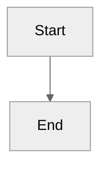
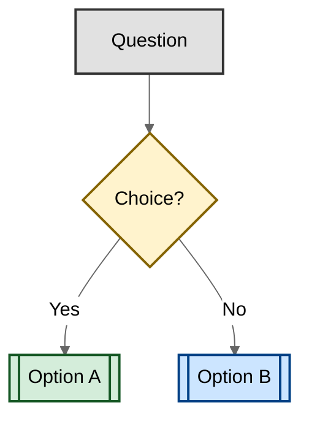

# AGENTS.md

GitHub Copilot agent mode workshop: Build an OctoFit Tracker fitness app with React frontend, Django REST backend, and MongoDB database in GitHub Codespaces.

## Boundaries

⚠️ **Ask first:**

- Modifying `.github/workflows/` (affects exercise validation)
- Changing `.github/instructions/` (affects other Copilot sessions)
- Modifying exercise steps in `.github/steps/` (affects workshop flow)

🚫 **Never:**

- Using ports other than 8000 (Django), 3000 (React), 27017 (MongoDB)
- Creating virtual environments outside `octofit-tracker/backend/venv/`
- Modifying `.devcontainer/` configuration

## Documentation Standards

- Use ATX-style headers (`#` not `===`)
- One sentence per line for easier diffs
- Use relative links for internal references
- Use neutral theme for Mermaid diagrams:

````markdown

````

- Use colors to improve diagram readability (decisions, outcomes, categories):

````markdown

````

## Troubleshooting

Use the troubleshooting prompt for automatic fixes:

```text
/fix-step <step_number>
```

See [TROUBLESHOOTING.md](.github/TROUBLESHOOTING.md) for detailed guidance.

## Additional Guidance

- **Story context**: Read [docs/octofit_story.md](docs/octofit_story.md) for application requirements
- **Exercise flow**: Any changes to workshop steps must be made in [.github/steps/](.github/steps/)
